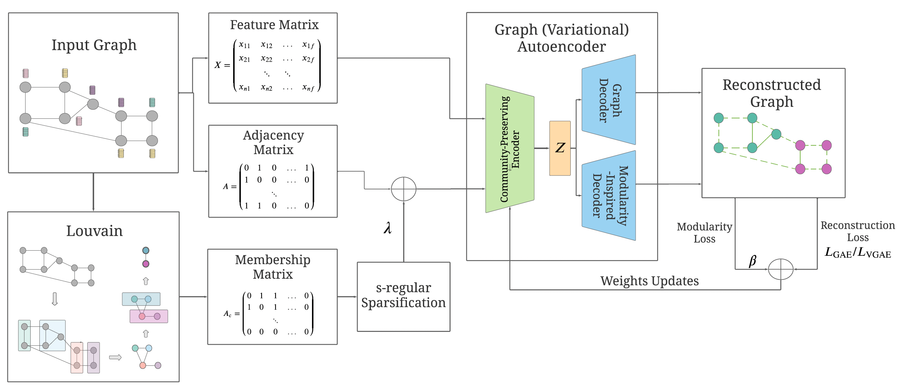

# Modularity-Aware Graph Autoencoders

This repository provides a Tensorflow implementation of the four models:
* Modularity-aware graph autoencoder with linear encoder;
* Modularity-aware graph autoencoder with 2-layer GCN encoder;
* Modularity-aware variational graph autoencoder with linear encoder;
* Modularity-aware variational graph autoencoder with 2-layer GCN encoder;

introduced in the article [Modularity-Aware Graph Autoencoders for Joint Community Detection and Link Prediction](https://arxiv.org/pdf/2202.00961.pdf).
This article has been accepted for publication in Elsevier's [Neural Networks](https://www.journals.elsevier.com/neural-networks) journal in 2022. It has also been presented at the [NeurIPS 2022 Workshop on New Frontiers in Graph Learning (GLFrontiers)](https://glfrontiers.github.io/) in New Orleans.

We provide the Blogs, Cora, Cora-Large, Citeseer, Pubmed, and SBM datasets in the `data` folder. 
The seventh dataset from our experiments, i.e., Deezer-Album, is a private dataset that we do not release in this repository.

This code extensively builds upon the [linear GAE/VGAE](https://github.com/deezer/linear_graph_autoencoders) and 
[FastGAE](https://github.com/deezer/fastgae) repositories by [Deezer](https://github.com/deezer), themselves building upon the original [Tensorflow implementation of GAE and VGAE](https://github.com/tkipf/gae) by [Thomas Kipf](https://github.com/tkipf).
<br>
<p align="center">
  
</p>


## Installation

```bash
git clone https://github.com/GuillaumeSalhaGalvan/modularity_aware_gae
cd modularity_aware_gae
python setup.py install
```

Requirements: networkx, numpy, python-louvain, scikit-learn, scipy, tensorflow (1.X).


## Run Experiments

A first quick test on Citeseer (20 training iterations only):

```bash
cd modularity_aware_gae
python train.py --dataset=citeseer --features=False --task=task_2 --model=linear_vae --iterations=20 --learning_rate=0.01 --hidden=32 --dimension=16 --beta=0.5 --lamb=0.75 --gamma=0.5 --s_reg=2 --fastgae=False --nb_run=1
```

Modularity-Aware models with settings from Table 7:
```bash
cd modularity_aware_gae
python train.py --dataset=blogs --features=False --task=task_2 --model=gcn_vae --iterations=200 --learning_rate=0.01 --hidden=32 --dimension=16 --beta=0.75 --lamb=0.5 --gamma=2 --s_reg=10 --fastgae=False --nb_run=1
python train.py --dataset=citeseer --features=False --task=task_2 --model=linear_vae --iterations=500 --learning_rate=0.01 --hidden=32 --dimension=16 --beta=0.5 --lamb=0.75 --gamma=0.5 --s_reg=2 --fastgae=False --nb_run=1
python train.py --dataset=citeseer --features=True --task=task_2 --model=linear_vae --iterations=500 --learning_rate=0.01 --hidden=32 --dimension=16 --beta=0.5 --lamb=0.75 --gamma=0.5 --s_reg=2 --fastgae=False --nb_run=1
python train.py --dataset=pubmed --features=False --task=task_2 --model=linear_ae --iterations=500 --learning_rate=0.01 --hidden=32 --dimension=16 --beta=0.5 --lamb=0.1 --gamma=0.1 --s_reg=5 --fastgae=False --nb_run=1
python train.py --dataset=pubmed --features=True --task=task_2 --model=linear_vae --iterations=700 --learning_rate=0.01 --hidden=32 --dimension=16 --beta=0.5 --lamb=0.1 --gamma=10 --s_reg=2 --fastgae=False --nb_run=1
python train.py --dataset=cora --features=False --task=task_2 --model=linear_ae --iterations=500 --learning_rate=0.01 --hidden=32 --dimension=16 --beta=1.0 --lamb=0.25 --gamma=0.25 --s_reg=1 --fastgae=False --nb_run=1
python train.py --dataset=cora --features=True --task=task_2 --model=linear_vae --iterations=300 --learning_rate=0.01 --hidden=32 --dimension=16 --beta=0.01 --lamb=0.001 --gamma=1 --s_reg=1 --fastgae=False --nb_run=1
python train.py --dataset=cora-large --features=False --task=task_2 --model=linear_vae --iterations=500 --learning_rate=0.01 --hidden=32 --dimension=16 --beta=0.1 --lamb=0.001 --gamma=0.1 --s_reg=10 --fastgae=False --nb_run=1
python train.py --dataset=sbm --features=False --task=task_2 --model=linear_vae --iterations=300 --learning_rate=0.01 --hidden=32 --dimension=16 --beta=0.1 --lamb=0.5 --gamma=2 --s_reg=10 --fastgae=True --nb_node_samples=10000 --measure=degree --alpha=1.0 --nb_run=1
```

Notes:
* The above commands will complete a single training for each model. Use the `nb_run` parameter to average scores over several model trainings.
* The above commands will evaluate results on "Task 2" from the paper, i.e., joint community detection and link prediction. Set `--task=task_1` to report results on "Task 1", i.e., pure community detection.
* The complete list of parameters is available in the `train.py` file.


## Cite

Please cite our paper if you use this code in your own work:

```BibTeX
@article{salhagalvan2022modularity,
  title={Modularity-Aware Graph Autoencoders for Joint Community Detection and Link Prediction},
  author={Salha-Galvan, Guillaume and Lutzeyer, Johannes F and Dasoulas, George and Hennequin, Romain and Vazirgiannis, Michalis},
  journal={Neural Networks},
  volume={153},
  pages={474--495},
  year={2022},
  publisher={Elsevier}
}
```
